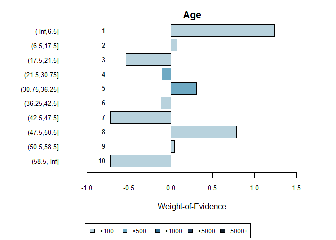
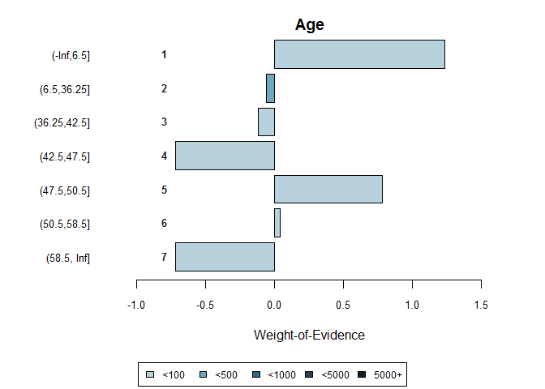
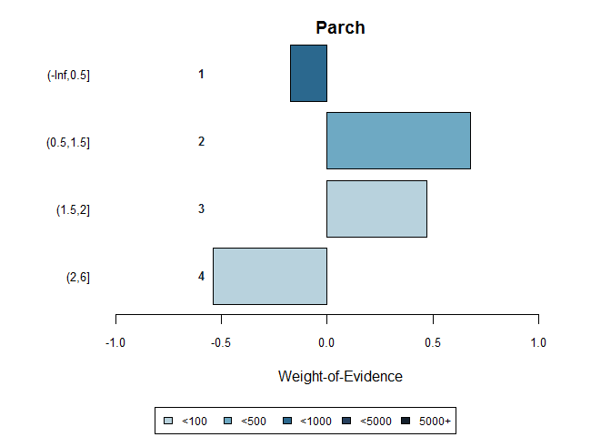
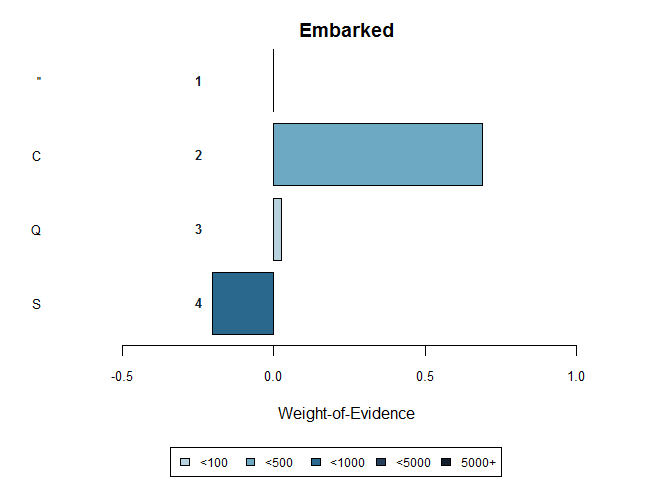
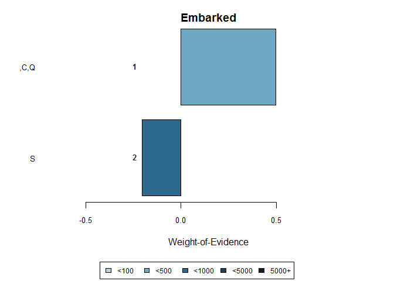

Overview
--------

binnr is an R package that supports the creation, modification, and
management of scorecard models. The primary building blocks of a binnr
model are objects called bins. Bins are created from an independent
variable and a binary response. Continuious variables are discretized
using a fast, greedy algorithm. Factors are not collapsed but benefit
from bin operations nonetheless.

The standard workflow of building models with binnr is outlined below:

1.  Bin the data using the `bin` function
2.  Modify the bins for predictiveness and palatability using the
    `adjust` function
3.  Fit a logistic regression model using the `fit` function
4.  Measure model performance and repeat steps 2-3 as necessary

### 1. Bin the data

`bin` can be used on a `data.frame` or vector components. The easiest
way is to provide a `data.frame` of independent predictors and a
response vector of 1s and 0s. This will return a `bin.list` object which
is a collection of bins.

    bins <- bin(titanic[,-1], titanic$Survived)

    bins

    ## binnr bin.list object
    ##   |--   7 Bins
    ##   |--   3 Discrete
    ##   |--   4 Continuous

A summary of the bins can be printed easily with the `summary` funciton:

    # only showing the first six columns for space
    summary(bins)[,1:6]

    ##       Name         IV # Bins # Unique Tot N # Valid
    ## 2      Sex 1.34168141      2        2   891     891
    ## 6     Fare 0.89070058     10      248   891     891
    ## 1   Pclass 0.50094974      3        3   891     891
    ## 3      Age 0.21978903     10       88   891     714
    ## 4    SibSp 0.18114137      4        7   891     891
    ## 7 Embarked 0.12237459      4        4   891     891
    ## 5    Parch 0.09745514      3        7   891     891

### 2. Adjust the bins

Bins often need to be manipulated. Levels may need to be collapsed,
expanded, neutralized, or otherwise massaged to make a palatable model.
The `adjust` function provides all of these capabilities and is the main
engine of scorecard development in `binnr`.

Calling `adjust` on certain binnr objects will create an interactive
session where commands may be entered to manipulate bins.

#### Collapse continuous

    # - 2:5
    plot(bins$Age)
    plot(bins$Age - 2:5)

#### Expand continuous

    # + 3
    plot(bins$Parch)
    plot(bins$Parch + 3)

#### Collapse discrete

    # - 1:3
    # Alternatively use: - c(1,2,3)
    plot(bins$Embarked)
    plot(bins$Embarked - 1:3)

### 3. Fit the bins

    mod <- fit(bins)

    mod

    ## binnr bin.list object
    ##   |--   7 Bins
    ##   |--   3 Discrete
    ##   |--   4 Continuous
    ## 
    ##          Coefficient Contribution Importance
    ## Sex        0.9577570  0.171267629 **********
    ## Pclass     0.8228789  0.040963504 **        
    ## Age        1.0618544  0.025578860 *         
    ## Fare       0.2822796  0.009519925           
    ## SibSp      0.3606966  0.004015689           
    ## Embarked   0.4518601  0.003586417
