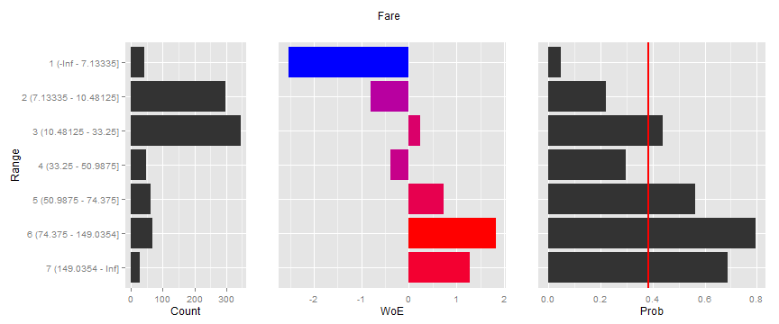
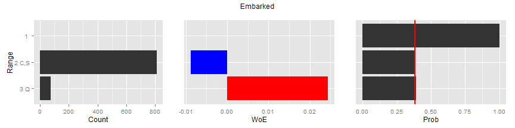

---
output:
  md_document:
    variant: markdown_github
---

<!-- README.md is generated from README.Rmd. Please edit that file -->


## What is `binner`?
`binnr` is a package that creates, manages, and applies simple binning
transformations.

## Usage
The easiest way to use `binnr` is with the `bin.data` function. When applied to 
a `data.frame`, `bin.data` creates a `bin` object for every variable and stores
the information necessary to apply a weight-of-evidence (WoE) substitution. Why
is this beneficial? Data is often not well-behaved or continuous. Variables can 
have exception values, missing values, or monotonic relationships that need to
be enforced. `binnr` accomodates all of these situations and further enables the
modeler to tweak variable transformations to their liking.

## Examples
We will use the titanic dataset that can be found in the `mjollnir` package for
all of the examples in this walkthrough.


```r
data(titanic, package='mjollnir')
head(titanic)
#>   Survived Pclass    Sex Age SibSp Parch    Fare Embarked
#> 1        0      3   male  22     1     0  7.2500        S
#> 2        1      1 female  38     1     0 71.2833        C
#> 3        1      3 female  26     0     0  7.9250        S
#> 4        1      1 female  35     1     0 53.1000        S
#> 5        0      3   male  35     0     0  8.0500        S
#> 6        0      3   male  NA     0     0  8.4583        Q
```

Inspecting the columns, we can see that this dataset encompases a variety
of data types: numeric & character, continuous & discrete. We can "class" these
variables by calling the `bin.data` function on this dataset and storing in
an object called `bins`:


```r
bins <- bin.data(titanic[,-1], titanic$Survived)
```

This stores all of the bin transformations in a list called `bins` that can be
accessed using standard R `$` indexing. The default action when typing a binned
variable and pressing `<enter>` is to display a WoE table:


```r
bins$Age
#> IV: 0.211 | Variable: Age
#> ---------------------------------------------------------------
#>                    #0  #1   W%0   W%1    W%  P(1)    WoE      IV
#> 1 (-Inf - 6.5]     14  33 0.033 0.114 0.066 0.702  1.237 0.09994
#> 2 (6.5 - 17.5]     38  28 0.090 0.097 0.092 0.424  0.074 0.00052
#> 3 (17.5 - 21.5]    65  26 0.153 0.090 0.127 0.286 -0.536 0.03414
#> 4 (21.5 - 30.75]  128  79 0.302 0.272 0.290 0.382 -0.103 0.00303
#> 5 (30.75 - 34.75]  38  30 0.090 0.103 0.095 0.441  0.143 0.00198
#> 6 (34.75 - 36.25]  18  22 0.042 0.076 0.056 0.550  0.581 0.01939
#> 7 (36.25 - 42.5]   41  25 0.097 0.086 0.092 0.379 -0.115 0.00120
#> 8 (42.5 - 47.5]    30  10 0.071 0.034 0.056 0.250 -0.719 0.02607
#> 9 (47.5 - 56.5]    27  27 0.064 0.093 0.076 0.500  0.380 0.01118
#> 10 (56.5 - Inf]    25  10 0.059 0.034 0.049 0.286 -0.536 0.01313
#> Missing           125  52    NA    NA    NA 0.294  0.000 0.00000
#> Total             549 342 1.000 1.000 1.000 0.384  0.000 0.21059
```

But it can also be plotted by calling the `plot` function on the binned variable:

```r
plot(bins$Age)
```

 

The y-axis displays the bin ranges for all of the plots. The first plot shows
bin counts, the second shows bin WoE, and the third shows bin probability of the
1-class for the dependent variable. The red line is the overall mean.

## `bin.data` options

### `mono`
The WoE  pattern for this varibale flips alot. A monotonic replationship can be
enforced by passing a mono argument to the bin.data function like so:


```r
bins <- bin.data(titanic[,-1], titanic$Survived, mono = c(Age=-1))
```


```r
plot(bins$Age)
```

 

Notice that a named vector of the form `c(VAR=MONO)` is passed in to the `mono`
argument. A global default may be passed in using the name `ALL`. `mono` can
take on the following values: `{-1, 0, 1}`. The monotonic relationship assumes
that the 1-class of the dependent variable is the target. Therefore a `-1` value
represents a target variable that decreases in likelihood as the independent
variable increases whereas a `1` value indicates an increases in the likelihood
of the target variable as the dependent variable increases.

### `exception`

It is not uncommon to have special values that should be considered valid for
binning. In such cases we wish to hold them out from the binning process yet
still use them for purposes of calculating information value. The `exception`
argument takes a named list of values that should be excluded from binning:


```r
bins <- bin.data(titanic[,-1], titanic$Survived, exceptions = list(SibSp=c(0,1)))
```

```r
plot(bins$SibSp)
```

 

Notice that 0s and 1s are now on their own levels below the binned continuous
values. 

### `min.iv`

The binning algorithm uses information value to break continuous variables into 
bins. The algorithm will only create a split if the resulting bins increase the 
overall variable information value by some value specified by `min.iv`. Larger
values will result in fewer bins.


```r
bins <- bin.data(titanic[,-1], titanic$Survived, min.iv=0, mono=c(Age=-1))
```

```r
plot(bins$Age)
```

 

### `min.cnt` & `max.bin`

`bin.data` can also be passed values controlling the size of resulting bins as
well as the maximum number of bins achieved. The default value for the `min.cnt`
is the square root of the number of observations. This generally results in 
adequate counts for the final binning scheme.

## Modyfing bins

`binnr` provides a number of convenience functions to expand, collapse, and
neutralize bin levels. The results are different for continuous and discrete
variables.

### Collapsing Bins

Continuous variables can only collapse adjacent bins. Discrete variables may
collapse non-adjacent bins. By default, `binnr` treats factors as discrete and
numeric variabls as continuous. To collapse bins, simply use the minus, `-`,
sign followed by a vector of the bin levels to collapse:


```r
plot(bins$Fare)
```

 

```r
plot(bins$Fare - 2:5)
```

 

Discrete bins can also be collapsed using the same notation:


```r
plot(bins$Embarked)
```

 

```r
plot(bins$Embarked - 1:3)
```

 


