    - [What is binnr?](#what-is-binnr)
    - [Usage](#usage)
    - [Examples](#examples)
    - [bin.data options](#bin-data-options)
        - [mono](#mono)
        - [exception](#exception)
        - [min.iv](#min-iv)
        - [min.cnt & max.bin](#min-cnt-max-bin)
    - [Modyfing bins](#modyfing-bins)
        - [Collapsing Bins](#collapsing-bins)
        - [Expanding Bins](#expanding-bins)
        - [Capping Bins](#capping-bins)
        - [Neutralizing Bins](#neutralizing-bins)
    - [Modeling with binnr](#modeling-with-binnr)
        - [Applying binnr transformations](#applying-binnr-transformations)
        - [Logistic Regression](#logistic-regression)
    - [TO BE CONTINUED...](#to-be-continued)


## What is `binnr`?
`binnr` is a package that creates, manages, and applies simple binning
transformations for further use in regression models. It provides a variety of
methods for collapsing and expanding variables to achieve the desired modeling
relationship.

## Usage
The easiest way to use `binnr` is with the `bin.data` function. When applied to 
a `data.frame`, `bin.data` creates a `bin` object for every variable and stores
the information necessary to apply a weight-of-evidence (WoE) substitution. Why
is this beneficial? Data is often not well-behaved or continuous. Variables can 
have exception values, missing values, or monotonic relationships that need to
be enforced. `binnr` accomodates all of these situations and further enables the
modeler to tweak variable transformations to their liking.

## Examples
We will use the titanic dataset that can be found in the `mjollnir` package for
all of the examples in this walkthrough.


```r
data(titanic, package='mjollnir')
head(titanic)
  Survived Pclass    Sex Age SibSp Parch    Fare Embarked
1        0      3   male  22     1     0  7.2500        S
2        1      1 female  38     1     0 71.2833        C
3        1      3 female  26     0     0  7.9250        S
4        1      1 female  35     1     0 53.1000        S
5        0      3   male  35     0     0  8.0500        S
6        0      3   male  NA     0     0  8.4583        Q
```

Inspecting the columns, we can see that this dataset encompases a variety
of data types: numeric & character, continuous & discrete. We can "class" these
variables by calling the `bin.data` function on this dataset and storing in
an object called `bins`:


```r
bins <- bin.data(titanic[,-1], titanic$Survived)
```

This stores all of the bin transformations in a list called `bins` that can be
accessed using standard R `$` indexing. The default action when typing a binned
variable and pressing `<enter>` is to display a WoE table:


```r
bins$Age
IV: 0.211 | Variable: Age
---------------------------------------------------------------
                   #0  #1   W%0   W%1    W%  P(1)    WoE      IV
1 (-Inf - 6.5]     14  33 0.033 0.114 0.066 0.702  1.237 0.09994
2 (6.5 - 17.5]     38  28 0.090 0.097 0.092 0.424  0.074 0.00052
3 (17.5 - 21.5]    65  26 0.153 0.090 0.127 0.286 -0.536 0.03414
4 (21.5 - 30.75]  128  79 0.302 0.272 0.290 0.382 -0.103 0.00303
5 (30.75 - 34.75]  38  30 0.090 0.103 0.095 0.441  0.143 0.00198
6 (34.75 - 36.25]  18  22 0.042 0.076 0.056 0.550  0.581 0.01939
7 (36.25 - 42.5]   41  25 0.097 0.086 0.092 0.379 -0.115 0.00120
8 (42.5 - 47.5]    30  10 0.071 0.034 0.056 0.250 -0.719 0.02607
9 (47.5 - 56.5]    27  27 0.064 0.093 0.076 0.500  0.380 0.01118
10 (56.5 - Inf]    25  10 0.059 0.034 0.049 0.286 -0.536 0.01313
Missing           125  52    NA    NA    NA 0.294  0.000 0.00000
Total             549 342 1.000 1.000 1.000 0.384  0.000 0.21059
```

But it can also be plotted by calling the `plot` function on the binned variable:

```r
plot(bins$Age)
```

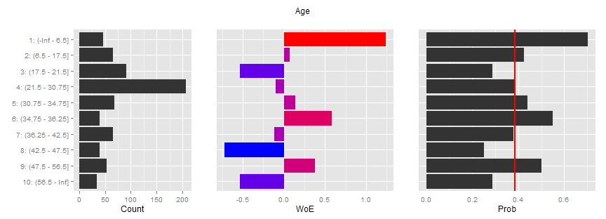 

The y-axis displays the bin ranges for all of the plots. The first plot shows
bin counts, the second shows bin WoE, and the third shows bin probability of the
1-class for the dependent variable. The red line is the overall mean.

## `bin.data` options

### `mono`
The WoE  pattern for the above varibale flips alot. A monotonic replationship
can be enforced by passing a mono argument to the `bin.data` function like so:


```r
bins <- bin.data(titanic[,-1], titanic$Survived, mono = c(Age=-1))
```


```r
plot(bins$Age)
```

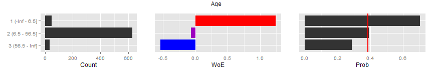 

Notice that a named vector of the form `c(var=mono)` is passed in to the `mono`
argument. A global default may be passed in using the name `ALL`. `mono` can
take on the following values: `{-1, 0, 1}`. The monotonic relationship assumes
that the 1-class of the dependent variable is the target. Therefore a `-1` value
represents a target variable that decreases in likelihood as the independent
variable increases whereas a `1` value indicates an increase in the likelihood
of the target variable as the dependent variable increases.

### `exception`

It is not uncommon to have special values that should be excluded from
binning. In such cases we wish to hold them out from the binning process yet
still use them for calculating information value. The `exception` argument
takes a named list of values that should be excluded from binning:


```r
bins <- bin.data(titanic[,-1], titanic$Survived, exceptions = list(SibSp=c(0,1)))
```

```r
plot(bins$SibSp)
```

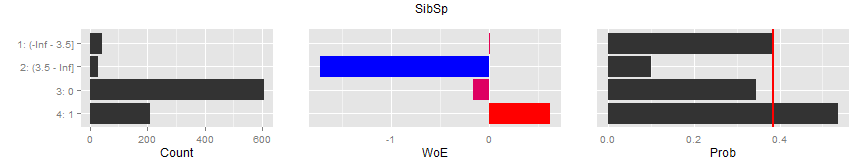 

Notice that 0s and 1s are now on their own levels below the binned continuous
values. 

### `min.iv`

The binning algorithm uses information value to break continuous variables into 
bins. The algorithm will only create a split if the resulting bins increase the 
overall variable information value by some value specified by `min.iv`. Larger
values will result in fewer bins.


```r
bins <- bin.data(titanic[,-1], titanic$Survived, min.iv=0, mono=c(Age=-1))
```

```r
plot(bins$Age)
```

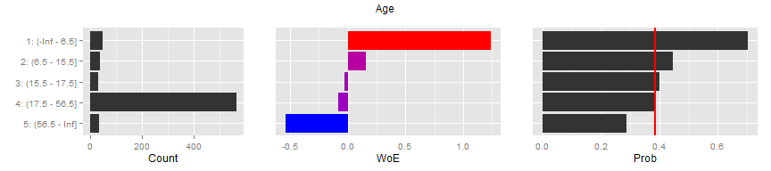 

### `min.cnt` & `max.bin`

`bin.data` can also be passed values controlling the size of resulting bins as
well as the maximum number of bins achieved. The default value for the `min.cnt`
is the square root of the number of observations. This generally results in 
adequate counts for the final binning scheme. `max.bin` defaults to 10 levels.

## Modyfing bins

`binnr` provides a number of convenience functions to expand, collapse, and
neutralize bin levels. The results are different for continuous and discrete
variables.

### Collapsing Bins

Continuous variables can only collapse adjacent bins. Discrete variables may
collapse non-adjacent bins. By default, `binnr` treats factors as discrete and
numeric variabls as continuous. To collapse bins, simply use the minus sign, `-`
, followed by a vector of the bin levels to collapse:


```r
plot(bins$Fare)
```

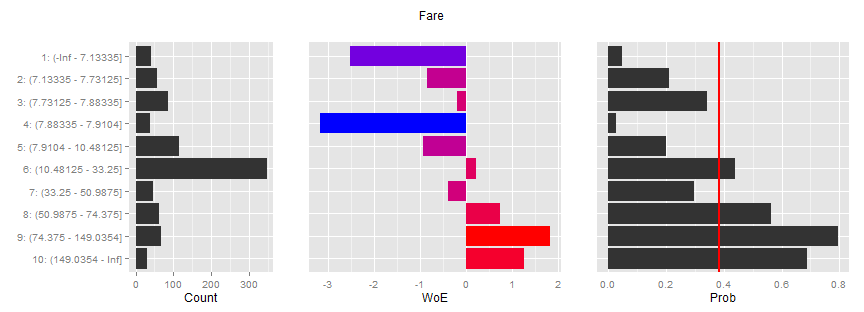 


```r
plot(bins$Fare - 2:5)
```

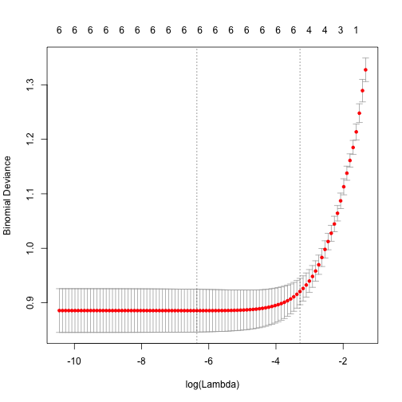 

Discrete bins can also be collapsed using the same notation:


```r
plot(bins$Embarked)
```

 

```r
plot(bins$Embarked - c(2,4))
```

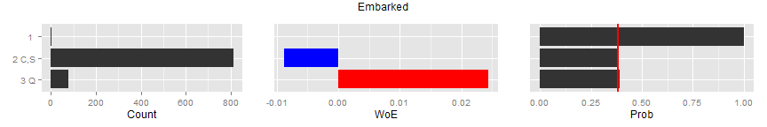 

### Expanding Bins

Bins may also be expanded. Like collapsing bins, the behavior depends on whether
the variable is discrete or continuous. Expanding a continuous range will
attempt to create five equally sized bins within the expanded range. When there
are fewer than five unique values in a bin, all of them will be expanded. For
discrete variables, only previously collapsed bins may be expanded. The notation
is to apply the plus sign, `+`, after a bin object followed by the number of the
level to expand:


```r
plot(bins$Parch)
```

 

```r
plot(bins$Parch + 3)
```

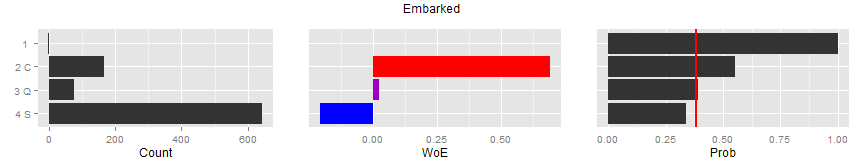 

Discrete bins can also be collapsed using the same notation:


```r
tmp <- bins$Embarked - c(2,4) # collapse bins 2 & 4
plot(tmp)
```

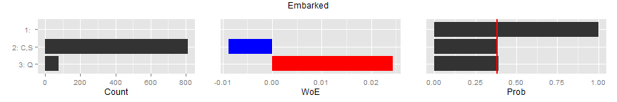 

```r
plot(tmp + 2) # expand bin 2 back to its original state
```

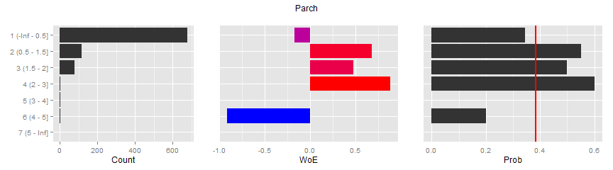 

### Capping Bins

For adverse action reasons it might be desirable to cap a variable at a specific
level. Using the less-than-or-equal sign, `<=`, followed by a number will cap
the variable at that number and rebin.


```r
plot(bins$Fare)
```

 

```r
plot(bins$Fare <= 30)
```

 

### Neutralizing Bins

`binnr` also allows the user to neutralize levels of a variable. The WoE
substitution will be zero for such levels and the remaining levels will be
updated to reflect the new counts. When passed into a regression model, neutral 
levels will contribute nothing to the final prediction. Neutralize levels by 
using the not-equal operator, `!=`, followed by the level to neutralize:

Inspecting the WoE table for Embarked, we see a nusiance level of 'blank' in the
first row.


```r
bins$Embarked
IV: Inf | Variable: Embarked
---------------------------------------------------------------
         #0  #1   W%0   W%1    W%  P(1)    WoE      IV
1         0   2 0.000 0.006 0.002 1.000    Inf     Inf
2 C      75  93 0.137 0.272 0.189 0.554  0.688 0.09315
3 Q      47  30 0.086 0.088 0.086 0.390  0.024 0.00005
4 S     427 217 0.778 0.635 0.723 0.337 -0.204 0.02917
Missing   0   0    NA    NA    NA   NaN  0.000 0.00000
Total   549 342 1.000 1.000 1.000 0.384  0.000     Inf
```

We can neutralize this level -- effectively removing its influence:


```r
bins$Embarked != 1
IV: 0.123 | Variable: Embarked
---------------------------------------------------------------
         #0  #1   W%0   W%1    W%  P(1)    WoE      IV
1         0   0 0.000 0.000 0.000   NaN    NaN     NaN
2 C      75  93 0.137 0.274 0.189 0.554  0.694 0.09506
3 Q      47  30 0.086 0.088 0.087 0.390  0.030 0.00008
4 S     427 217 0.778 0.638 0.724 0.337 -0.198 0.02759
Missing   0   0    NA    NA    NA   NaN  0.000 0.00000
Total   549 340 1.000 1.000 1.000 0.382  0.000 0.12273
```

## Modeling with `binnr`

The goal of `binnr` is to enable the modeler to apply variable transformations
with an eye towards training a logistic regression model. `binnr` will
substitute the WoE for each variable creating a dataset of continuous values.
The WoE substitution is particularly desirable because the resulting logistic
regression parameters are on the same scale and can be compared directly. The
model building process involves applying the bin transformations, fitting a 
model, and analyzing the results.

### Applying `binnr` transformations

Applying transformations is as simple as calling predict on the list of `bin`
objects and passing in a dataset.


```r
binned <- predict(bins, titanic)
```

```r
head(binned)
         Pclass        Sex         Age      SibSp      Parch       Fare    Embarked
[1,] -0.6664827 -0.9838327 -0.08040052  0.6170756 -0.1737481 -0.8484681 -0.20359896
[2,]  1.0039160  1.5298770 -0.08040052  0.6170756 -0.1737481  0.7327989  0.68839908
[3,] -0.6664827  1.5298770 -0.08040052 -0.1660568 -0.1737481 -0.9238176 -0.20359896
[4,]  1.0039160  1.5298770 -0.08040052  0.6170756 -0.1737481  0.7327989 -0.20359896
[5,] -0.6664827 -0.9838327 -0.08040052 -0.1660568 -0.1737481 -0.9238176 -0.20359896
[6,] -0.6664827 -0.9838327  0.00000000 -0.1660568 -0.1737481 -0.9238176  0.02433748
```

We now have a matrix where every transformation has been applied to its
corresponding variable. To understand what has happened, we can print a table:

Here is the WoE table for the variable `Sex`:

```
IV: 1.342 | Variable: Sex
---------------------------------------------------------------
          #0  #1   W%0   W%1    W%  P(1)    WoE      IV
1 female  81 233 0.148 0.681 0.352 0.742  1.530 0.81657
2 male   468 109 0.852 0.319 0.648 0.189 -0.984 0.52512
Missing    0   0    NA    NA    NA   NaN  0.000 0.00000
Total    549 342 1.000 1.000 1.000 0.384  0.000 1.34168
```

And here is the raw variable crossed with the transformed variable:

```
                    
                     female male
  -0.983832709241577      0  577
  1.52987700334019      314    0
```

We can verify that values of `male` are being coded correctly to the value found
in the WoE table. The same holds true for `female`.

### Logistic Regression

Once the variable transformations have been applied, a logistic regression
model may be fit. We will be applying a new logistic regression algorithm called
`LASSO`. It fits the model and performs variable selection at the same time.
More about LASSO regression can be found
[here](http://statweb.stanford.edu/~tibs/lasso.html).

LASSO regression requires that we specify a penalty argument to constrain the 
coefficients. We will be using cross-validation to determine this parameter
automatically. Furthermore, since our variables are already transformed the way
we like, we will also force the parameters to be greater than zero. This will
prevent any "flips" from occuring in our final model.


```r
fit <- cv.glmnet(binned, titanic$Survived, alpha=1, family="binomial",
                 nfolds = 5, lower.limits=0)
plot(fit)
```

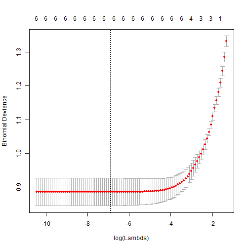 

The resulting plot shows the error on the y-axis and the penalty term on the
x-axis. The penalty term controls the size of the coefficients and how many of
them are not equal to zero. The first dashed line represents the size of the
penalty term that has the lowest cross-validation error. We can access this
value easily by using the "lambda.min" argument where appropriate. For example, 
to find the optimal coefficients:


```r
coef(fit, s="lambda.min")
8 x 1 sparse Matrix of class "dgCMatrix"
                     1
(Intercept) -0.4727612
Pclass       0.9551438
Sex          0.9781791
Age          1.4504149
SibSp        0.4606033
Parch        .        
Fare         0.2561144
Embarked     0.5601308
```

# TO BE CONTINUED...
